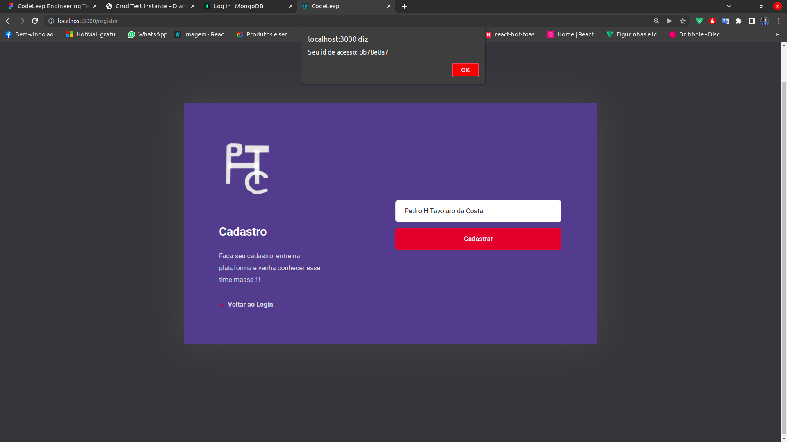
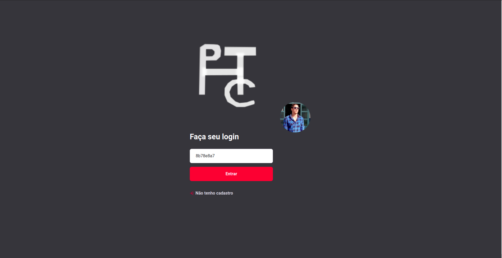
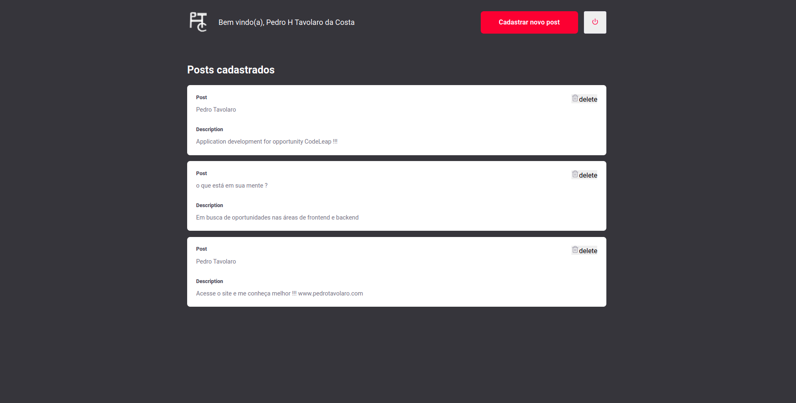
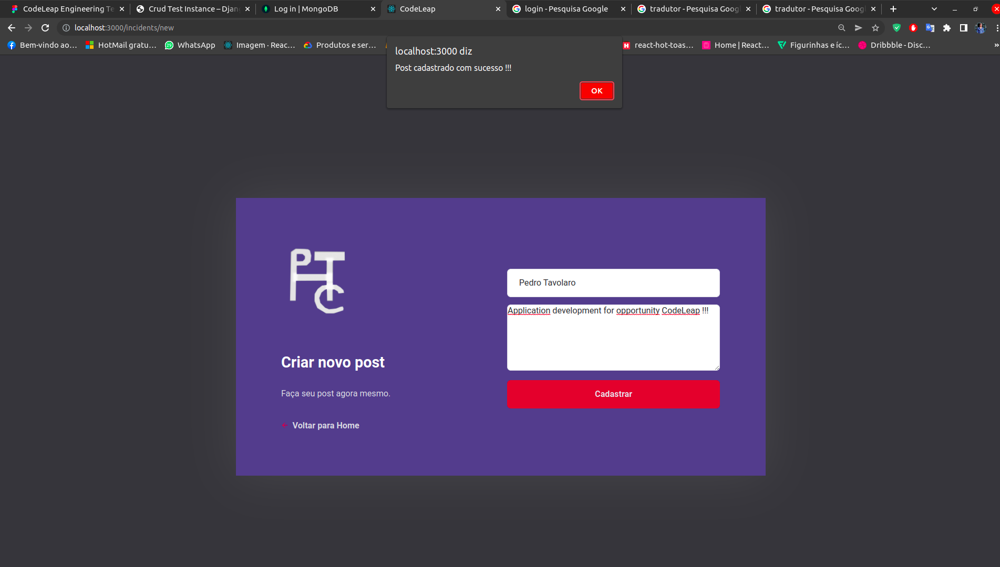
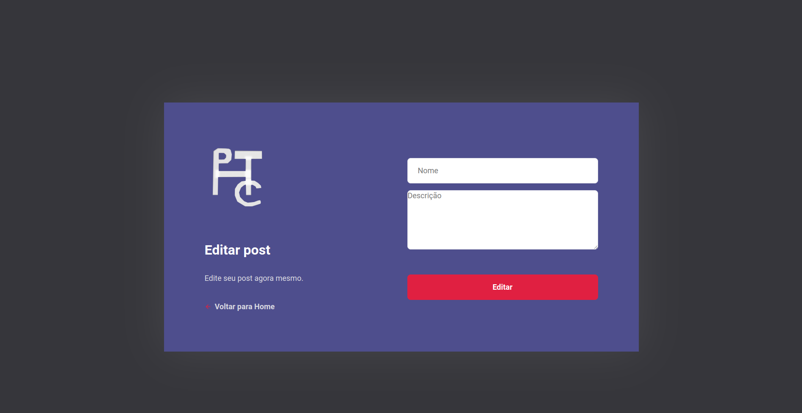
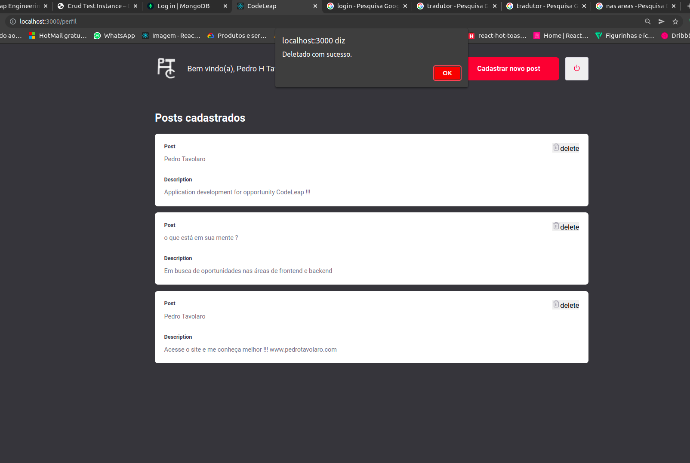

<h1 align="center">CodeLeap</h1>

## Descrição do Projeto

 Projeto desenvolvido em busca de oportunidade na CodeLeap. O projeto dispõe das funcionalidades de login do usuário, metódo post para criar um novo post com algumas informações e metódo delete para apagar o post tudo integrado com backend node.  

  
  <!--ts-->
   * [Features](#features)
   * [Tecnologias](#tecnologias)
   * [Rodando a Aplicação](#como-executar-o-projeto)
   * [Como contribuir para o projeto](#como-contribuir-para-o-projeto)
   * [Autor](#autor)
<!--te-->

 
<a href="https://pt-br.reactjs.org/">🔗 React</a>
<a href="https://nodejs.org/en/">🔗 NodeJs</a>
<a href="https://www.npmjs.com/">🔗 NPM</a>

  

🚀 lib para construir interfaces do usuário com componentes reutilizáveis

   

<h4 align="center"> 
    🚧  React Select 🚀 concluído...  🚧
 </h4>
 
  ### Features

- [x] Login do usuário
- [x] Cadastro do post
- [x] Delete do post 
- [ ] Edit do post

<h1 align="center">
  
  
    

</h1>
<h1 align="center">
 
   
  
</h1>

<h1 align="center">

  
</h1>

## Tecnologias 
As seguintes ferramentas foram usadas na construção do projeto:

- [React](https://pt-br.reactjs.org/)
- [NodeJs](https://nodejs.org/en/)

## Como executar o projeto
💡

### Pré-requisitos
Antes de começar, você vai precisar ter instalado em sua máquina as seguintes ferramentas:
[NodeJs](https://nodejs.org/en/),
[NPM](https://www.npmjs.com/) 
Além disto é bom ter um editor para trabalhar com o código como [VSCode](https://code.visualstudio.com/)

### 🚀 Rodando a aplicação

Este projeto é divido em duas partes:
1. Backend (pasta server) 
2. Frontend (pasta web)

💡O Frontend precisa que o Backend esteja sendo executado para funcionar.

## Clone este repositório
$ git clone https://github.com/PedroTavolaro/CodeLeap.git

## Acesse a pasta do projeto no seu terminal/cmd
$ cd CodeLeap

## Acesse a pasta backend do projeto no seu terminal/cmd
$ cd backend

# 🎲 Rodando o Backend (servidor)

## Instale as dependências
$ npm install 

$ veja o arquivo https://github.com/PedroTavolaro/CodeLeap/blob/main/backend/package.json e instale suas dependências

## Crie as migrations
$ npx knex migrate:latest

## Execute o backend
$ npm start

# 🧭 Rodando a aplicação web (Frontend)

## Instale as dependências
$ npm install ou yarn install

$ veja o arquivo https://github.com/PedroTavolaro/CodeLeap/blob/main/frontend/package.json e instale suas dependências

## Execute a aplicação
$ npm start

## 📝 Licença
Este projeto esta sobe a licença [MIT](./LICENSE).

## Como contribuir para o projeto
1. Faça um **fork** do projeto.
2. Crie uma nova branch com as suas alterações: `git checkout -b my-feature`
3. Salve as alterações e crie uma mensagem de commit contando o que você fez: `git commit -m "feature: My new feature"`
4. Envie as suas alterações: `git push origin my-feature`
> Caso tenha alguma dúvida confira este [guia de como contribuir no GitHub](./CONTRIBUTING.md)
### Autor
---

<a href="https://pedrotavolaro.com">
 
  
 <b>PedroTavolaro</b></a> <a href="https://www.pedrotavolaro.ccom" title="PedroTavolaro">🚀</a>

Feito com ❤️ por Pedro Tavolaro 👋🏽 Entre em contato!

  

